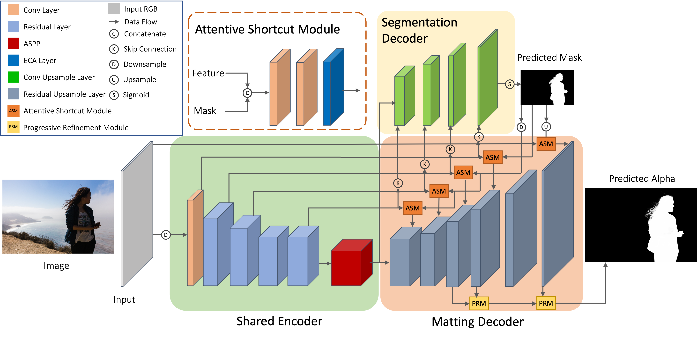

<h2 align="center">Semantic Guided Human Matting - SGHM</h2>

<div align="center"><i>Robust Human Matting via Semantic Guidance (ACCV 2022)</i></div>


<div align="center"><b>SGHM is a  robust and accurate method for automatic human matting  which requires no trimap input. Semantic guidance is well incorporated into our model to predict coarse mask and fine-grained alpha matte successively.</b></div>

<div align="center">
  <a href="https://arxiv.org/abs/2210.05210">
    
  </a>
  <a href="https://colab.research.google.com/github/BreezeWhite/segpeo/blob/master/colab.ipynb">
    
  </a>
</div>

## Highlights

- **Semantic Guided Network :** A segmentation sub-network is first employed for the task of segmentation, and then it is reused to guide the matting process to focus on the surrounding area of the segmentation mask. To improve the performance and reduce computation, we share semantic encoder in two tasks. Under the guidance of powerful semantic features, our matting module successfully handle many challenging cases.
- **Data Efficient :** With only about 200 matting images, our method is able to produce high quality alpha details.  We can efficiently improve matting performance by collecting more coarse human masks in an easy and fast way rather than paying for the high cost fine-detailed alpha annotating.
- **SOTA Result :** We conduct comparisons on 5 benchmarks  qualitatively and quantitatively. SGHM outperforms other methods across all benchmarks.




## Usage ##

1. Install Segpeo from Github

  ```bash
  pip install git+https://github.com/BreezeWhite/segpeo
```

### Available Options
```
usage: segpeo [-h] -i IMAGE_PATH [-o OUTPUT_DIR] [-c CHECKPOINT_PATH]

Test Images

options:
  -h, --help            show this help message and exit
  -i IMAGE_PATH, --image-path IMAGE_PATH
                        Could be a file path or a directory that contains images
  -o OUTPUT_DIR, --output-dir OUTPUT_DIR
                        Path to output the result image. Default to the same folder of input image.
  -c CHECKPOINT_PATH, --checkpoint-path CHECKPOINT_PATH
                        Optionally provide your own checkpoint to use. Will download and use the default
                        model if not specified.
  ```

2. Test your own images

  The output path will default to the same folder as input.
  ```bash
  # Will automatically download the checkpoint upon first run.
  segpeo --image-path "PATH_TO_FILE_OR_DIR"
  ```

3.  Test your video (Not yet incorporated, please refer to the original [repo](https://github.com/cxgincsu/SemanticGuidedHumanMatting))

  ```python
  python test_video.py \
      --video "PATH_TO_INPUT_VIDEO" \
      --output-video "PATH_TO_OUTPUT_VIDEO" \
      --pretrained-weight SGHM-ResNet50.pth
  ```


## Bibtex

If you use this code for your research, please consider to star this repo and cite our paper.

 ```latex
@inproceedings{chen2022sghm,
  author = {Chen, Xiangguang and Zhu, Ye and Li, Yu and Fu, Bingtao and Sun, Lei and Shan, Ying and Liu, Shan},
  title = {Robust Human Matting via Semantic Guidance},
  booktitle={Proceedings of the Asian Conference on Computer Vision (ACCV)},
  year={2022}
}
 ```

## Acknowledgement
In this project, parts of the code are adapted from : [BMV2](https://github.com/PeterL1n/BackgroundMattingV2) and [MG](https://github.com/yucornetto/MGMatting) . We thank the authors for sharing codes for their great works.
